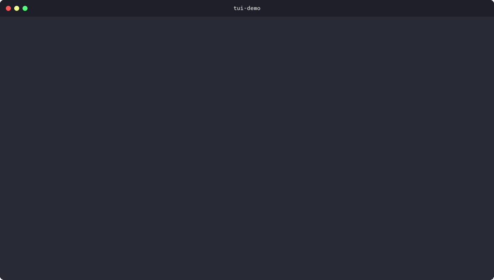
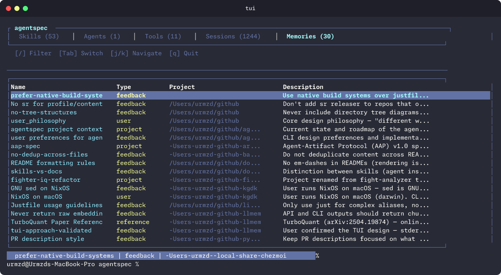

<p align="center">
  <h1 align="center">agentspec</h1>
  <p align="center">
    Universal agent skill and sub-agent manager with TUI.
    <br /><br />
    <a href="#installation">Install</a>
    &middot;
    <a href="https://github.com/urmzd/agentspec/issues">Report Bug</a>
    &middot;
    <a href="https://crates.io/crates/agentspec">Crates.io</a>
  </p>
</p>

<p align="center">
  <a href="https://github.com/urmzd/agentspec/actions/workflows/ci.yml"></a>
  <a href="https://crates.io/crates/agentspec"></a>
  &nbsp;
  <a href="LICENSE"></a>
</p>

## Showcase

<table align="center">
  <tr>
    <td align="center">
      
      <br />
      <sub><b>Interactive TUI: every tab, including MCP server management</b></sub>
    </td>
    <td align="center">
      
      <br />
      <sub><b>Register an MCP server once, use it in every tool</b></sub>
    </td>
  </tr>
</table>

## Features

- **Unified resource management.** Add, remove, link, validate, and create skills, agents, memories, project configs, instruction files, and llms-txt across tools.
- **Discovery & sync.** Auto-discover resources across your filesystem, adopt them, and link to all tools in one command.
- **Integrity verification.** Checksum-based verification to detect modified or corrupted resources.
- **Sessions.** List, search, fuzzy-find, and export AI coding sessions (Claude, Codex, Copilot, Gemini) as markdown, plus cross-tool sync/import of portable handoffs. `session search` filters by text, role (`--role user` finds what you actually asked), project, files touched, tool used, and date, in human or JSON output. Copilot exports are enriched with summary, repo, branch, files touched, checkpoints, and references.
- **Fleets.** Manage multi-agent fleets through a backend interface: a no-tmux store backend for portable orchestration state, and a native tmux backend compatible with the `orchestrate-agents` fleet helper.
- **Worktrees.** Create, list, and remove per-repo git worktrees under `<repo>/.worktrees/` without switching the primary checkout.
- **MCP server management.** Register a server once and have it appear natively in all 9 MCP-capable tools, whatever dialect each speaks: `mcpServers` JSON (Claude Code, Gemini CLI, Cursor, GitHub Copilot, Windsurf, Cline), Amp's `amp.mcpServers` key, Codex's `[mcp_servers.<name>]` TOML tables, and OpenCode's `mcp` key. `mcp adopt` pulls tool-native servers into the canonical store; `mcp doctor` shows every target, path, and dialect.
- **Permission profile sync.** Maintain one portable allowlist and translate it into Claude and Gemini native permission settings.
- **Hook management.** Store lifecycle hook scripts once and link them into tool hook directories.
- **Plugin tracking.** Inventory installed Claude Code plugins and export a portable manifest.
- **Planning artifacts.** Import Gemini CLI antigravity plans into the canonical store and list them.
- **Memory browser.** Browse Claude Code memories across projects, filter by type, and pull/push between tools and the shared store.
- **Project sync.** Sync project-level instruction files (AGENTS.md, CLAUDE.md, llms.txt) into a shared store.
- **Bootstrap.** `agentspec bootstrap` installs agentspec's own usage skills into every detected tool, so the agents on the machine can discover and drive it without being told how.
- **Introspection.** `agentspec tools` reports every supported tool and where it stores things; `agentspec commands --format json` dumps the whole command tree for agents.
- **Prune.** Remove broken resources and stale symlinks in one pass.
- **Deduplication.** Find duplicate resources by content hash or name.
- **TUI.** Interactive terminal UI with tabbed views for skills, agents, tools, sessions, fleets, memories, and configs. The Fleets tab includes backend-selected agent creation with `a` including optional managed worktree creation, a scrollable selected-agent message panel for store-backed transcripts and tmux captures, direct message sending with `s`, guardian event ingestion with `e`, state marking with `m`, attach command preview with `t`, route policy review with `i`, brief/full context toggling with `c`, matched-session route preview/routing with `p`/`r`, and fleet-wide preview/routing with `P`/`R`. It inherits your terminal theme.
- **IR layer.** Canonical representation with vendor adapters (agentskills, Claude, Gemini) plus instruction-file adapters (AGENTS.md, CLAUDE.md, llms.txt). Copilot is supported as a session source.

### Supported tools

Claude Code, Cline, Windsurf, OpenHands, Gemini CLI, GitHub Copilot, Amp, Cursor, Codex, OpenCode, Kimi CLI

## Installation

### Script

```sh
curl -fsSL https://raw.githubusercontent.com/urmzd/agentspec/main/install.sh | sh
```

### Cargo

```sh
cargo install agentspec
```

### From source

```sh
git clone https://github.com/urmzd/agentspec
cd agentspec
cargo build --release
```

## Quick Start

```sh
# Teach every installed AI tool how to use agentspec
agentspec bootstrap

# Discover all resources and link to every detected tool
agentspec sync --adopt

# Launch the interactive TUI
agentspec

# Add a skill from GitHub and link to all tools
agentspec manage add owner/repo --all-tools

# Find the session where you asked about rate limiting
agentspec session search "rate limit" --role user --since 7d
```

## Usage

```
agentspec                                    # Launch interactive TUI
agentspec --help                             # What agentspec is, and how to use it
agentspec bootstrap                          # Install agentspec's usage skills into every tool
agentspec tools                              # Every supported tool, installed state, and paths
agentspec commands --format json             # Full command tree, machine-readable

# Status & sync
agentspec status                             # Show managed and unmanaged resources
agentspec status --fast                      # Skip broad filesystem scan
agentspec sync                               # Discover, adopt, link, and verify
agentspec sync --adopt                       # Auto-adopt all discovered resources

# Resource management
agentspec manage add <source>                # Add resource (path, git URL, owner/repo)
agentspec manage add <source> --all-tools    # Add and link to all detected tools
agentspec manage add <source> --kind agent   # Override auto-detected kind
agentspec manage remove <name>               # Remove a managed resource
agentspec manage all --all-tools             # Adopt all discovered resources
agentspec manage list                        # List managed resources
agentspec manage list --dedup                # Show duplicate resources
agentspec manage link <name> <tool>          # Link a resource to a tool
agentspec manage unlink <name> <tool>        # Unlink a resource from a tool
agentspec manage validate [path]             # Validate a SKILL.md or AGENT.md
agentspec manage create <name> --kind skill  # Scaffold a new resource
agentspec manage update [name]               # Re-pull and refresh a resource (or all)
agentspec manage verify                      # Verify resource integrity (checksums)
agentspec manage verify --accept             # Accept current state and update hashes
agentspec manage memory                      # Browse Claude Code memories
agentspec manage memory --type feedback      # Filter memories by type
agentspec manage memory --pull               # Pull tool memories into the shared store
agentspec manage memory --push               # Push shared memories back into tools

# Project config sync
agentspec project sync                       # Sync project instruction files to shared store
agentspec project status                     # Show project sync state
agentspec project desync <project>           # Stop auto-sync (synced copy stays but goes stale)
agentspec project remove <project>           # Delete the synced copy (originals untouched)

# Sessions
agentspec session find                       # Fuzzy-find a session across sources
agentspec session list                       # Newest sessions across every source
agentspec session list claude --limit 50     # List sessions for one source (claude, codex, copilot, gemini)
agentspec session search "rate limit" --role user      # Find what you actually asked, not the restatement
agentspec session search --source copilot --project agentspec --since 7d --format json
agentspec session search "cargo\s+build" --regex --hits 10 --context 400
agentspec session search --tool-used Bash --file src/mcp/mod.rs
agentspec session export copilot --last      # Export most recent session (Copilot is enriched)
agentspec session export claude <id>         # Export a specific session
agentspec session export claude --last -o f.md  # Write export to file
agentspec session policy                     # Show what context may be routed or synced
agentspec session sync claude codex --last   # Stage brief allowed context as a handoff for a target tool
agentspec session sync claude codex --last --context full  # Stage the explicit full transcript
agentspec session import codex handoff.md     # Import an external markdown handoff for a target tool
agentspec session active                      # Correlate active fleet panes with likely sessions
agentspec session route claude <pane> --last --dry-run  # Preview exactly what would be routed
agentspec session route claude <pane> --last --backend store  # Send brief allowed context to a fleet pane
agentspec session route-active <pane> --backend store  # Auto-pick the best session match for a pane
agentspec session route-fleet refactor-auth --dry-run  # Preview matched context routes for every agent in a fleet

# Fleets
agentspec fleet doctor                       # Show selected backend and availability
agentspec fleet start refactor-auth          # Create/adopt a fleet (auto backend)
agentspec fleet --backend store spawn refactor-auth api codex --name reviewer
agentspec fleet spawn refactor-auth api codex --name reviewer --worktree api --repo .
agentspec fleet --backend store send store:refactor-auth:reviewer-1 "Review the API diff"
agentspec fleet --backend store mark refactor-auth store:refactor-auth:reviewer-1 done --note "Review complete"
agentspec fleet --backend store event refactor-auth 'GUARDIAN[store:refactor-auth:reviewer-1]: needs-permission - "Approve edit?" - awaiting user decision'
agentspec fleet --backend tmux survey        # Survey active tmux panes through the native backend
agentspec fleet list refactor-auth           # List agents and states

# Worktrees
agentspec worktree list                      # List git worktrees for the current repo
agentspec worktree create api                # Create .worktrees/api from origin/HEAD or HEAD
agentspec worktree remove api                # Remove .worktrees/api and worktree-* branch

# MCP servers
agentspec mcp add sr --command sr --args "mcp serve"  # Register a stdio server in store + tool configs
agentspec mcp add docs --url https://example.com/mcp --type http  # Register a remote server
agentspec mcp add sr --command sr --tool github-copilot  # Register only in one tool
agentspec mcp list                           # Show canonical store + per-tool registrations
agentspec mcp doctor                         # Every MCP-capable tool: installed, path, dialect
agentspec mcp adopt                          # Pull tool-native servers into the canonical store
agentspec mcp link sr --all-tools            # Inject a stored server into all MCP-capable tools
agentspec mcp unlink sr --tool claude-code   # Remove from one tool config, keep the store
agentspec mcp remove sr                      # Remove everywhere: tool configs + canonical store
agentspec mcp sync                           # Link every stored server into all MCP-capable tools

# Plans
agentspec plans import gemini                 # Import Gemini CLI antigravity planning artifacts
agentspec plans list                          # List plans in the canonical store

# Permissions
agentspec permissions init                    # Scaffold ~/.agents/permissions.yml
agentspec permissions sync                    # Translate the profile into each tool's allowlist
agentspec permissions sync --dry-run          # Show what would change without writing
agentspec permissions show --tool claude-code # Show the profile and a tool's rendered allowlist

# Plugins
agentspec plugins list                        # Inventory installed Claude Code plugins
agentspec plugins export -o plugins.yml       # Export a portable plugin manifest

# Hooks
agentspec hooks add ./pre-commit.sh           # Copy a hook script into the canonical store
agentspec hooks list                          # Show canonical store + per-tool hooks
agentspec hooks link pre-commit.sh --all-tools  # Link a stored hook into tool hook dirs

# Cleanup
agentspec prune                              # Dry-run report of broken resources and stale symlinks
agentspec prune --yes                        # Actually remove them

# Maintenance
agentspec update                             # Update agentspec to the latest release
agentspec version                            # Print version

# Global flags
agentspec manage list --format json          # Machine-readable JSON (--format human|json is global)
agentspec manage list --by-hash              # Show only content duplicates (same hash)
agentspec manage list --by-name              # Show only name duplicates (same name, many locations)
```

## Configuration

### Storage

```
~/.agents/skills/<name>/SKILL.md    Shared skill store
~/.agents/agents/<name>.md          Shared agent store
~/.agents/projects/                 Synced project instruction files
~/.agents/memories/<project>/       Shared memory store
~/.agents/plans/<artifact>.md       Imported planning artifacts
~/.agents/sessions/<target>/        Portable session handoffs
~/.agents/fleets/<name>.json        Store-backed multi-agent fleet state
~/.agents/mcp/<name>.json           Canonical MCP server store
~/.agents/hooks/                    Lifecycle hook scripts
~/.agents/permissions.yml           Portable permission profile (on demand)
~/.agents/plugins.yml               Exported plugin manifest (on demand)
~/.config/agentspec/config.yml      Inventory and discovery cache
```

### Discovery

`agentspec status` and `agentspec sync` scan two places:

- **Tool directories.** Known paths for each detected tool (e.g. `~/.claude/skills/`, `~/.gemini/agents/`).
- **Broad filesystem walk.** Walks from `$HOME` up to 6 levels deep, looking for `SKILL.md`, agent markdown files, `AGENTS.md`, `CLAUDE.md`, and `llms.txt`. Skipped with `--fast`.

Discovered resources appear as "unmanaged" in `agentspec status`. Use `sync --adopt` or `manage add <name>` to adopt them into the shared store.

### Linking

`manage link` copies resources from the shared store (`~/.agents/skills/foo`) into tool directories (e.g. `~/.claude/skills/foo`). Use `--symlink` to create a relative symlink instead of a copy, and `--all-tools` to link to every detected tool at once.

## Workspace crates

| Crate | Description |
|-------|-------------|
| [`agentspec`](crates/agentspec) | The CLI + TUI described in this README |
| [`agentspec-sdk`](crates/agentspec-sdk) | Rust SDK for bootstrapping AI-powered CLI tools: config and CLI scaffolding helpers |

## Roadmap

Cross-tool session sync, memory sync, MCP server management, permission profile sync, hook management, plugin tracking, and planning-artifact import have all shipped. See [ROADMAP.md](ROADMAP.md) for remaining future ideas.

## Agent Skill

agentspec ships its own usage skills, compiled into the binary and sourced from
[`crates/agentspec/skills/`](crates/agentspec/skills/):

| Skill | Teaches |
| --- | --- |
| [`agentspec-usage`](crates/agentspec/skills/agentspec-usage/SKILL.md) | when and how to drive the CLI |
| [`resource-conventions`](crates/agentspec/skills/resource-conventions/SKILL.md) | where every resource lives and what format it uses |

```sh
agentspec bootstrap              # write both into ~/.agents/skills and link them everywhere
agentspec bootstrap --tools claude-code,codex
```

Bootstrap is idempotent and never overwrites a same-named skill you brought
yourself unless you pass `--force`.

## License

[Apache-2.0](LICENSE)
